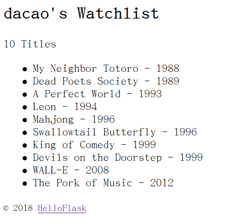
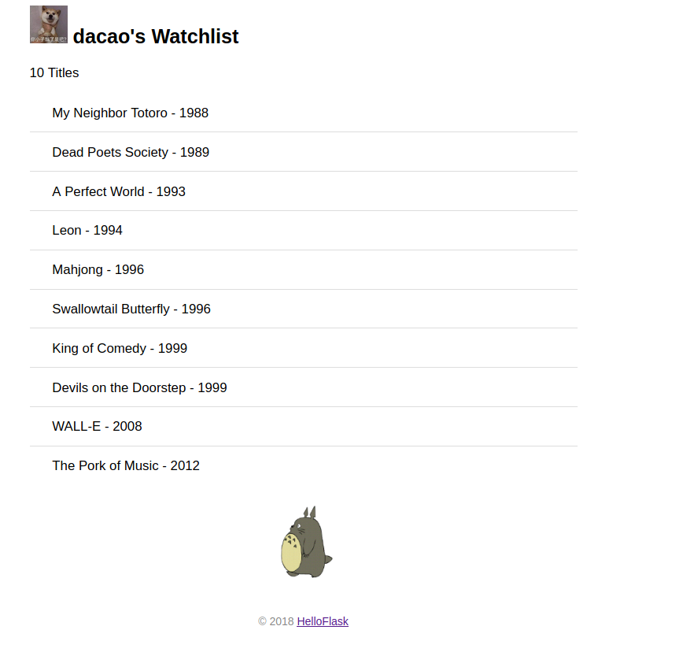

# 《flask入门教程》实践
[toc]

## chapter01 准备工作

参考：[要不我们还是用回 virtualenv/venv 和 pip 吧](https://zhuanlan.zhihu.com/p/81568689)

```shell
#流程：

#克隆一个空的仓库
git clone git@github.com:da1234cao/watchlist.git

#charm 打开该仓库目录文件,发现默认的是python2.7
charm watchlist

#包安装
pip3 install virtualenv
sudo apt install python3-venv

#创建虚拟环境watchlist
python3 -m venv watchlist

#激活虚拟环境
source ./watchlist/bin/activate 

#安装flask
(watchlist) pip install flask

#提交仓库
vim .gitignore #创建一个.gitignore
git status; git add; git commit; git push;
```

<br>

<br>

## chapter02 Hello,Flask

在学习语言的时候，验证我们环境的安装情况，我们，通常会输出 ”神奇“的 "hello world"。

此处也是。代码见上面的仓库。

### 环境变量

```shell
#运行flask run,当默认的程序名称不是app.py
export FLASK_APP=XXX

#FLASK_ENV默认为 production 。在开发时，我们需要开启调试模式（ debug mode） 。 
export FLASK_ENV=development 
```

为了不用每次打开新的终端会话都要设置环境变量， 我们安装用来管理系统环境变量的 python-dotenv。

<br>

### URL规则

绑定多个URL、url_for的使用。

**url_for() 函数最简单的用法是以视图函数名作为参数，返回对应的url。**

```python
from flask import url_for

@app.route('/')
def hello():
	return 'Hello'

@app.route('/user/<name>')
def user_page(name):
	return 'User: %s' % name

@app.route('/test')
def test_url_for():
	# 下面是一些调用示例（ 请在命令行窗口查看输出的 URL） ：
	print(url_for('hello')) # 输出： /
	# 注意下面两个调用是如何生成包含 URL 变量的 URL 的
	print(url_for('user_page', name='greyli')) # 输出： /user/greyli
	print(url_for('user_page', name='peter')) # 输出： /user/peter
	print(url_for('test_url_for')) # 输出： /test
	# 下面这个调用传入了多余的关键字参数， 它们会被作为查询字符串附加到 URL后面。
	print(url_for('test_url_for', num=2)) # 输出： /test?num=2
	return 'Test page
```


<br>

<br>

## chapter03 模板

上一章，我们视图函数是这样定义的：

```python
def hello():
	return '<h1>Hello Totoro!</h1>'
```

但是，**我们的html肯定不是一个字符串可以解决的。**

所以我们得使用html文件。

> 我们把包含变量和运算逻辑的 HTML 或其他格式的文本叫做模板， 执行这些变量替换和逻辑计算工作的过程被称为渲染， 这个工作由我们这一章要学习使用的模板渲染引擎——Jinja2 来完成。

**我们使用render_template() 函数把模板渲染出来。**

```python
@app.route('/')
def index():
	return render_template('index.html', name=name, movies=movies)
```



<br>

<br>

## chapter04 静态文件

上一章是渲染模板。**静态文件（ static files） 和我们的模板概念相反， 指的是内容不需要动态生成的文**
**件。 比如图片、 CSS 文件和 JavaScript 脚本等。**

主要点：**生成静态URL**

```html

```

其他内容是css的部分。我仅仅知道最近本的css,写出来的难看得很。我拷贝了书中的css.



<br>

<br>


## 附录

[生成 GitHub README.md 目录](https://sleepeatcode.com/articles/15/generating-the-github-readme-directory)

